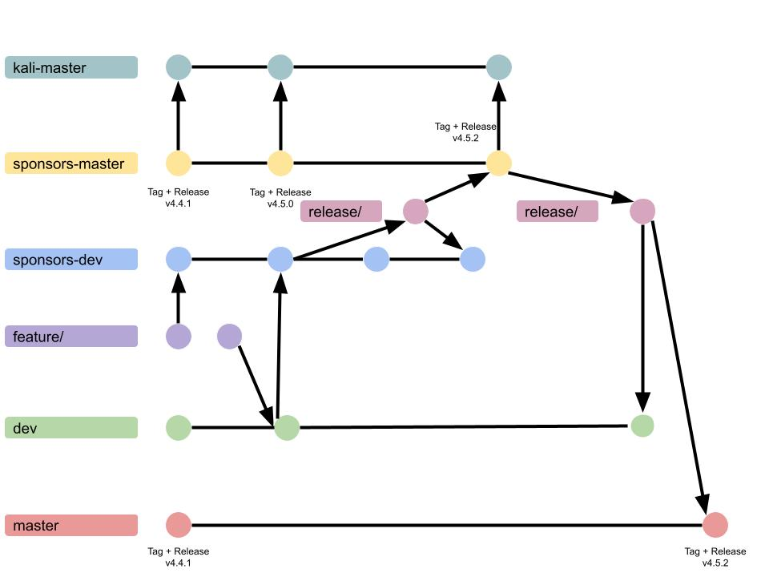

# CI Processes

## Build and Test
All pull requests open to `sponsors-master`, `master`, `sponsors-dev`, `dev` will run the `Lint and Test` workflow. The workflow will run `black` and `isort` checks and then run `pytest` on Python 3.8 and Python 3.9.

## BC-SECURITY/Empire-Sponsors Release Process
### 1. Merge public dev branch into sponsors-dev
Run the `Sponsor - Merge public dev branch` manual workflow. The branch that it runs on doesn't matter,
because it will always checkout the same branch (`sponsors-dev`) no matter what.
The workflow will checkout `sponsors-dev` on `BC-SECURITY/Empire-Sponsors`, then merge `dev` from `BC-SECURITY/Empire`.
It will then open a pull request into `sponsors-dev`.

Review and merge the pull request. **DO NOT SQUASH**

### 2. Start Release
Start a release by running the `Sponsors - Create Release` manual workflow on the sponsors-dev branch.
The workflow will then create a release branch, push it to the repo, and create a pull request into `sponsors-dev` and `sponsors-master`.

* Updates `pyproject.toml` version
* Updates `empire.py` version
* Updates `CHANGELOG.md`

If you run this workflow off the `sponsors-master` branch, it will do the same, but won't contain commits from the dev branch.
So if for example there are commits on dev that we don't want to include in the release, you can just push them to the `sponsors-master`
branch and they will be included in the release.

### 3. Manual Steps
Once the first workflow runs, it will open two pull requests from the `release/v{version}` branch to `sponsors-dev` and `sponsors-master`.

Merge the two pull requests. **DO NOT SQUASH**

### 4. Tag and Release
Once the pull requests are merged, run the `Sponsors - Tag Release` workflow on the `sponsors-master` branch.
The workflow will create a tag and release on the `HEAD` of `sponsors-master`, using the release notes from `CHANGELOG.md` for the body of the release.

The successful tagging and release on `sponsors-master` will automatically trigger the `Sponsors - On Release` workflow. This workflow will checkout `kali-master` and merge `sponsors-master` into it. Then it will push `kali-master` and generate a tag and release with the `-kali` suffix.
If the `On Release` job fails, someone must manually merge `sponsors-master` into `kali-master`, then rerun the job.

### Setup
Requires a secret in the repo `RELEASE_TOKEN` that has `repo` and `workflow` access.

## BC-SECURITY/Empire Release Process
### 1. Start Release
Start a release by running the `Public - Create Release` manual workflow. It doesn't matter which branch it runs on.
For the workflow input, provide the tag name that you want to release.

The workflow will then checkout the chosen tag in the `sponsors` repo, create a release branch, push it to the public repo,
and create a pull request into `dev` and `master`.

### 2. Manual Steps
Once the first workflow runs, it will open two pull requests from the `release/v{version}` branch to `dev` and `master`.

Merge the two pull requests. **DO NOT SQUASH**

### 3. Tag Release
Once the pull requests are merged, run the `Public - Tag Release` workflow on the `master` branch.
As an input, provide the tag name for the earliest release that should be included in the release notes.
For example, if we previously release `v4.4.1` on the public repo, and we are now release `v4.5.2`, we would put `v4.5.0`,
so that the release notes contain the changelog from `v4.5.0-v4.5.2`

The workflow will create a tag and release on the `HEAD` of `master`, using the release notes from `CHANGELOG.md` for the body of the release.

### Docker Builds
The `Docker Image CI` workflow will build the docker image for the release. Pushes to `master` will update the `latest` tag, while pushes to the `dev` branch will update the `dev` tag.
Tagged releases will push to the corresponding tag in DockerHub.

### Setup
Requires secrets in the repo `DOCKER_USERNAME` and `DOCKER_PASSWORD` as well as `RELEASE_TOKEN` that has `repo` and `workflow` access.

## Diagram

## Contributing
To update the sponsor workflows, merge to `sponsors-master` in `Empire-Sponsors` and then merge `sponsors-master` back into `sponsors-dev`
To update the public workflows, merge to `master` in `Empire` and then merge `master` back into `dev`