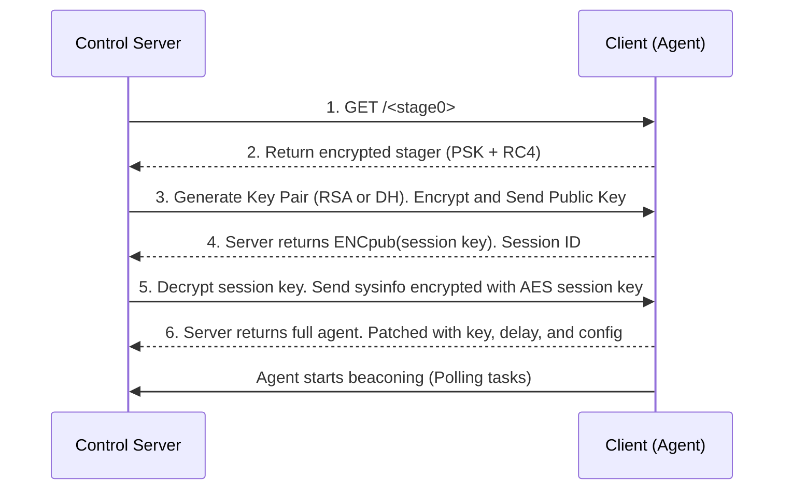

# Empire Staging Process

Empire uses an [Encrypted Key Exchange](https://en.wikipedia.org/wiki/Encrypted_key_exchange) \(EKE\) mechanism to securely establish communications between the control server and agents. In previous versions, the key negotiation was handled using RSA, but the modern implementation has been adapted to support multiple agent types, including PowerShell, C#, Python, IronPython, and Go.

Key points in the staging process:
1. The PowerShell agent uses RSA-based key exchange.
2. The C#, Python, IronPython, and Go agents use Diffie-Hellman (DH) key exchange.
3. A pre-shared key (PSK) is used to encrypt the routing packet with RC4.
4. Stage 1 involves session key negotiation and establishing an encrypted channel.
5. Stage 2 delivers the full agent to start beaconing.

## Stage 0 Request (Launcher Execution)
The agent initiates communication by making a request to the control server at a predefined URI. The staging key (pre-shared key) is sent with the request.

## Stage 0 Response (Key Negotiation)
The server returns a stager script (e.g., stager.ps1 for PowerShell). This stager is case-randomized and RC4-encrypted with the pre-shared key.

## Stage 1: Session Key Exchange
The agent generates an RSA key pair (PowerShell) or performs a Diffie-Hellman key exchange (Other Agents).  The encrypted public key is sent to the server.  The server returns the session ID and an AES session key, encrypted for the agent.

# Stage 2: Agent Delivery
The agent decrypts the AES session key and gathers system information. This system information is encrypted and sent to the server. The server responds with the full agent, patched with configuration details (e.g., key, beacon delay, routing info). The agent registers and starts beaconing for tasking. This updated process ensures more secure and flexible key exchanges while maintaining strong encryption across multiple agent types.

