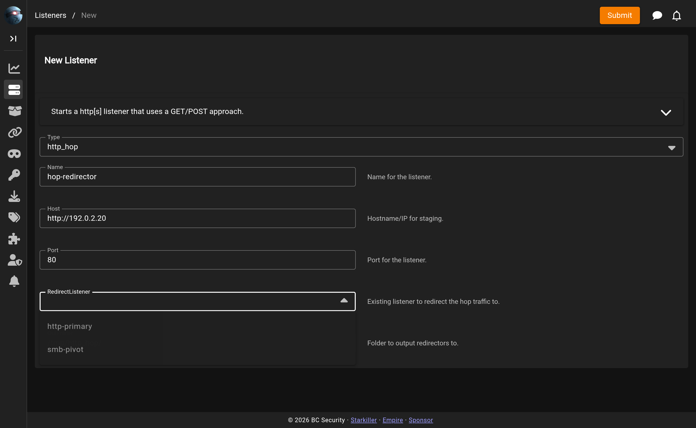

# HTTP Hop

The HTTP Hop listener adds an intermediate **redirector** in front of a real HTTP listener. It generates PHP files that you deploy on a disposable hop host; agents beacon to the hop, and the hop forwards their traffic to the backing listener. This keeps your real C2 server off the agent's beacon path.

## Key Configuration Options

### RedirectListener

The existing HTTP/S listener that the hop forwards traffic to. Empire automatically extracts the `RedirectStagingKey` and `DefaultProfile` from this listener, so the hop and the backing listener stay in sync.

<figure><figcaption>Selecting the redirect listener when creating an HTTP Hop listener</figcaption></figure>

### Host / Port

The hostname/IP and port agents will use to reach the **hop** host (not the backing server).

### OutFolder

Local folder where the generated PHP redirector files are written (default `/tmp/http_hop/`). Deploy these files onto the hop host's web server.

## When to use

Use a hop listener when you want a cheap, throwaway redirection layer — the hop host runs only PHP and can be burned without touching your real listener.
