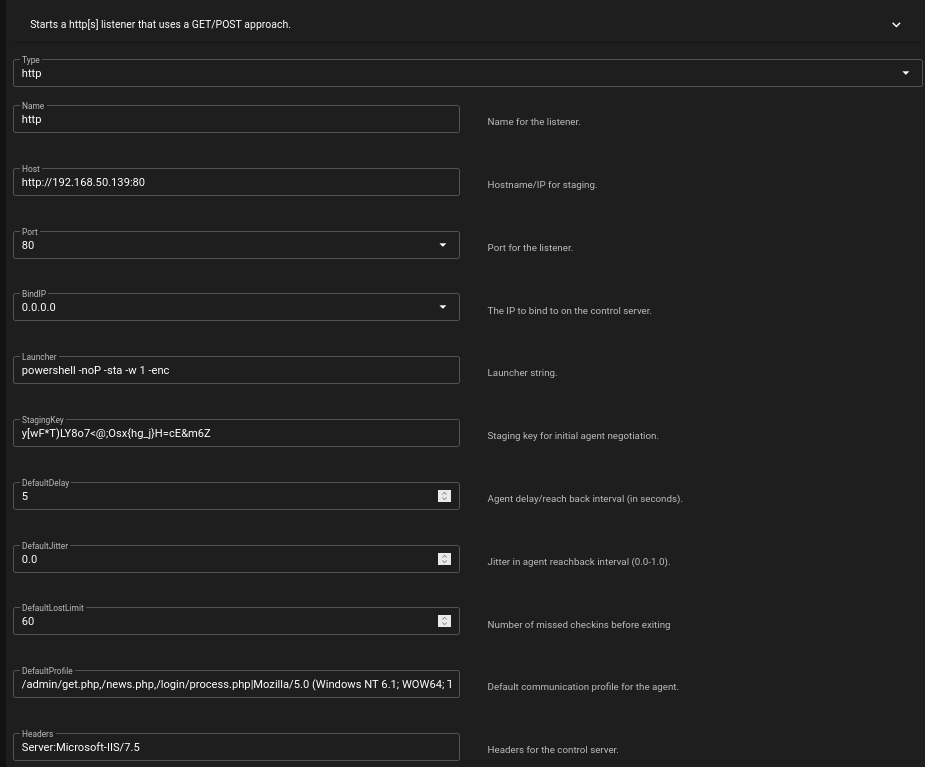
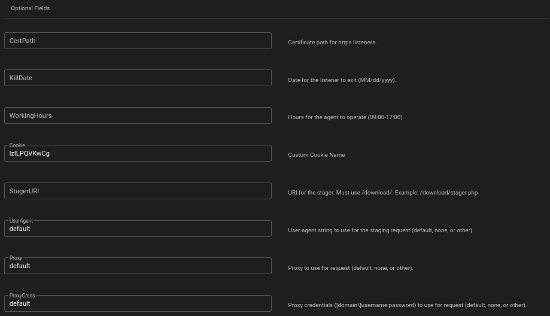

# HTTP

The HTTP listener in Empire is one of the most commonly used communication channels for agents. It operates over **HTTP and HTTPS**, using **GET and POST** requests to relay data between agents and the Empire server.

By default, the HTTP listener runs on:

* **Port 80 for HTTP**
* **Port 443 for HTTPS** However, any port can be specified based on operational needs.

## Key Configuration Options

<div align="center"> </div>

### **Staging Key**

The **staging key** is used to negotiate the **session key** between the agent and the server. This ensures a secure communication channel and assigns the agent its **session ID**.

### **Delay & Jitter**

* **Delay** – The interval (in seconds) at which the agent checks back with the server.
* **Jitter** – A randomness factor (between **0 and 1**) that modifies the delay to avoid detection.

### **DefaultLostLimit**

This setting determines the number of **missed check-ins** before an agent assumes it has lost communication and exits.

### **Default Profile**

The **default profile** defines how the agent communicates with the server, including:

* **Endpoints**
* **Headers**
* **User-Agent string**

It is structured using `|` as a separator between these values.

#### **Example Default Profile**

```plaintext
/admin/get.php,/news.php,/login/process.php|Mozilla/5.0 (Windows NT 6.1; WOW64; Trident/7.0; rv:11.0) like Gecko
```

#### Example Control Server Headers

```plaintext
Server:Microsoft-IIS/7.5
```

### JA3 Evasion

Empire provides JA3 evasion to help prevent detection by TLS fingerprinting tools. This feature is based on the research published by BC Security: [JA3 Signatures and How to Avoid Them](https://bc-security.org/ja3-s-signatures-and-how-to-avoid-them/)

### Optional Fields

Empire provides additional settings to customize listener behavior:

* CertPath – Path to an SSL certificate for HTTPS listeners.
* KillDate – The expiration date when the agent will automatically exit (MM/DD/YYYY).
* WorkingHours – Defines when the agent will operate (09:00-17:00).
* Cookie – Custom cookie name used for agent communication.
* StagerURI – The URI for the stager (must use /download/, e.g., /download/stager.php).
* UserAgent – Defines the user-agent string used for staging requests (default, none, or other).
* Proxy – Proxy settings for agent communication.
* ProxyCreds – Proxy credentials (domain\username:password).

## Default Response Page

When accessed directly, the HTTP listener returns a response page similar to an IIS7 server:


