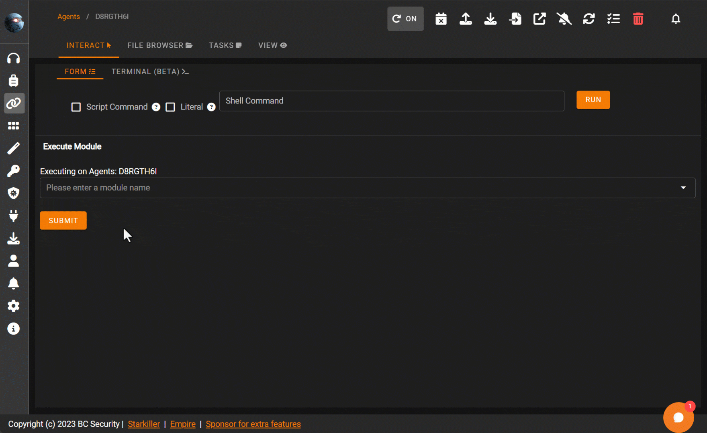

# Modules

Empire provides a flexible framework for executing various types of scripts and binaries, including PowerShell, Python, .NET assemblies, and beacon object files (BOF). This section outlines how modules work, including YAML configuration, dynamic options, and new ways to run external scripts without the need for a dedicated module.

## What Are Modules?

Modules in Empire are reusable pieces of code that allow operators to perform tasks like data collection, lateral movement, or command execution. These modules can be customized and executed using YAML configuration files. Empire modules use various programming languages, including PowerShell, Python, and C#.

## Running External Scripts without a Dedicated Module

You can import and execute external scripts such as PowerShell or Python without the need to create a fully dedicated module. This is useful for quick operations where you want to load and execute a script on the fly.

### Examples

Importing and Executing PowerShell Scripts

Importing and Executing Python Scripts

Example: Running a .NET Assembly

