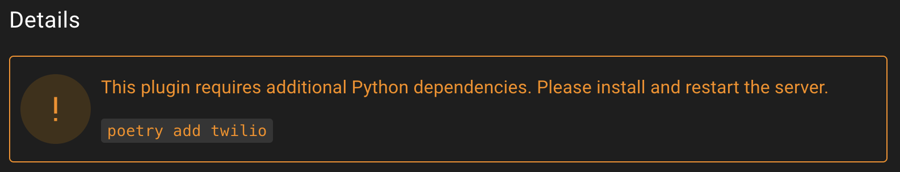

# Plugins

Plugins are an extension of Empire that allow for custom scripts to be loaded.
This allows anyone to build or add community projects to extend Empire functionality.

## Installing Plugins

Plugin installation is available through the Starkiller __Plugin Marketplace__.

### Auto-Installing Plugins

Plugins can be automatically installed during `./ps-empire setup` by adding them to the
`auto_install` list in `config.yaml`. This is useful for Docker builds or automated deployments
where plugins need to be pre-installed without manual API calls.

```yaml
plugin_marketplace:
  registries:
    - name: BC-SECURITY
      git_url: https://github.com/BC-SECURITY/Empire-Plugin-Registry.git
      ref: main
      file: registry.yaml
  auto_install:
    - name: Report Generation Plugin
      version: '2.0.0'
      registry: BC-SECURITY
```

Each entry requires `name`, `version`, and `registry` matching a plugin in the configured registries.
Plugins that are already installed will be skipped.

### Additional Dependencies

If a plugin requires additional Python dependencies, the plugin page will show a warning
that the dependencies need to be installed before the plugin can be loaded.


