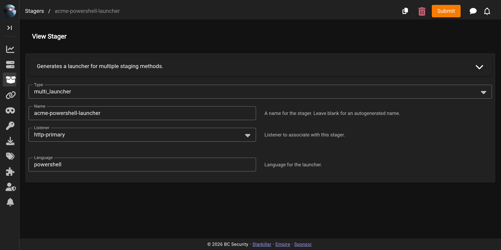

# Stagers

A **stager** produces the artifact that gets an Empire agent running on a target and calling back to a [listener](../listeners/README.md). Depending on the type, that artifact is a one-liner, a script, an Office macro, a compiled binary, or shellcode — but the job is always the same: execute Empire's **stage 0** on the target, negotiate a session with the listener, and pull down the full agent.

## Staged vs. stageless

- **Staged** (the default): the artifact is a small stage0 launcher. On execution it reaches back to the listener, performs the key exchange, and downloads the rest of the agent in stages. Smaller artifact, but it needs network access to the listener at run time.
- **Stageless**: the whole agent is bundled into one self-contained artifact via [`multi_generate_agent`](multi_generate_agent.md). Larger, but runs with no additional callbacks — useful for restricted-egress environments and debugging.

## Choosing a stager

Every stager is created from a **stager template** in Starkiller (or via `POST /api/v2/stagers`). Pick the template that matches how you'll deliver and execute the payload on the target platform:

<figure><figcaption>Generating a stager in Starkiller</figcaption></figure>

### Cross-platform

| Stager | Produces |
|--------|----------|
| `multi/launcher` | One-liner stage0 launcher |
| `multi/generate_agent` | Stageless, fully-formed agent (Python/IronPython/PowerShell) |
| `multi/macro` | Win/Mac cross-platform MS Office macro |
| `multi/go_exe` | Go binary with embedded stager code |

### Windows

| Stager | Produces |
|--------|----------|
| `windows/launcher_bat` | Self-deleting `.bat` launcher (HTTP/HTTPS listeners) |
| `windows/launcher_vbs` | `.vbs` launcher |
| `windows/launcher_xml` | XML file to run with MSBuild.exe |
| `windows/cmd_exec` | Windows command executable (msfvenom) stage 0 |
| `windows/csharp_exe` | PowerShell C# solution compiled to an executable |
| `windows/dll` | PowerPick reflective DLL to inject |
| `windows/hta` | HTA for Internet Explorer |
| `windows/macro` | Office macro (97-2003 and 2007+) |
| `windows/shellcode` | Windows shellcode stager |
| `windows/shellcode_launcher` | Compiled PIC (position-independent code) shellcode `.bin` that stages an agent over HTTP[S] |
| `windows/c_launcher` | Compiled C stager that downloads stage 1 .NET payloads |
| `windows/wmic` | XSL stylesheet run via wmic.exe |
| `windows/war` | Deployable WAR file |
| `windows/bunny` | Bash Bunny stage0 script |
| `windows/ducky` | Rubber Ducky stage0 script |
| `windows/teensy` | Teensy stage0 script |

### Linux

| Stager | Produces |
|--------|----------|
| `linux/bash` | Self-deleting Bash script running the stage0 launcher |
| `linux/pyinstaller` | ELF binary payload launcher built with pyInstaller |

### macOS

| Stager | Produces |
|--------|----------|
| `osx/applescript` | AppleScript running the stage0 launcher |
| `osx/application` | macOS `.app` bundle |
| `osx/macro` | macOS Office macro (newer Office) |
| `osx/dylib` | dylib payload |
| `osx/jar` | JAR file |
| `osx/macho` | Mach-O executable |
| `osx/safari_launcher` | HTML payload launcher |
| `osx/shellcode` | macOS shellcode launcher |
| `osx/ducky` | Rubber Ducky script |
| `osx/teensy` | Teensy script |

### Compiled C# agents

| Stager | Produces |
|--------|----------|
| `CSharpPS` | PowerShell C# solution with embedded stager, compiled |
| `CSharpPy` | IronPython C# solution with embedded stager, compiled |
| `Sharpire` | C# Empire agent |
| `SharpireMalleable` | C# Empire agent with malleable-profile interpreter |

For stagers with operational nuance, see their dedicated pages below.
