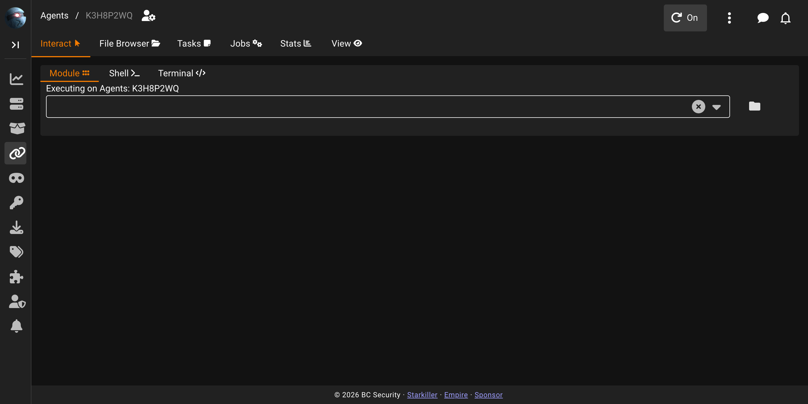
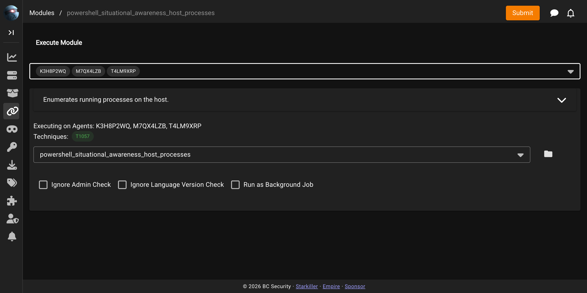
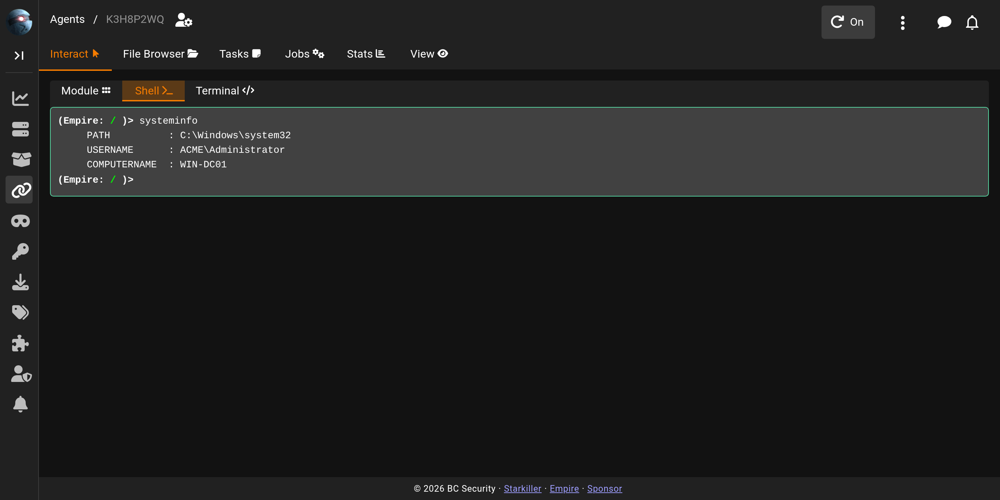
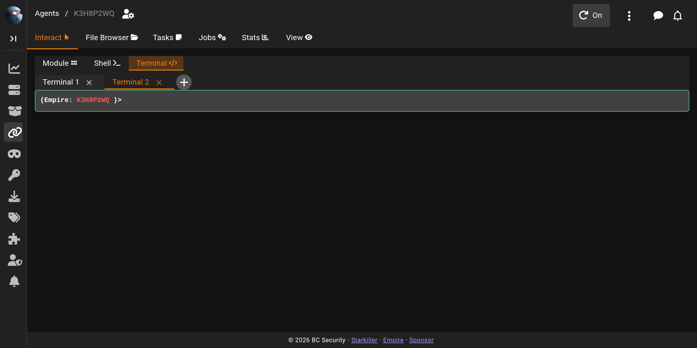

# Agent Interact

**Interact** is the default tab in the agent workspace and where you task the agent. It has three sub-modes, switched with an inner tab strip: **Module**, **Shell**, and **Terminal**. Starkiller remembers the last sub-mode you used for each agent and reopens it the next time you visit that agent.

## Module

The Module sub-mode is the same module runner used elsewhere in Starkiller, scoped to this agent. Search for a module by name or browse the folder tree; selecting one opens an info viewer with its description and MITRE ATT&CK technique chips, followed by its options form. Fill in the options and submit to queue the tasking.

### Tasking multiple agents

The same module runner backs multi-agent tasking: from the Modules screen, selecting several agents before choosing a module tasks all of them at once with the same options. Only modules compatible with every selected agent's language are offered — if the selection has no module in common, Starkiller shows "No modules are compatible with all selected agents."

## Shell

Shell is a single, persistent command session with the agent. Type a command at the prompt and its output renders below with ANSI colour preserved. Command history is available with the up and down arrows, and Tab offers completion suggestions as you type.

There is no Literal option, and there's no alias layer to opt out of: every command you type runs as-is through the agent's system shell.

## Terminal

Terminal uses the same underlying engine as Shell, but supports multiple named tabs instead of a single session. Add a new tab with the **+** button; right-click a tab for a context menu to rename it, or close it with its **x** button once more than one tab is open. The tab set is saved per agent and restored across reloads.

## Shell vs. Terminal

Both sub-modes give you an interactive command prompt against the agent, but they serve different workflows. Shell is a single session for straightforward, sequential work. Terminal exists for juggling several lines of work on one agent at once — keep a long-running task in one tab while you poke around in another, each with its own history and output.
