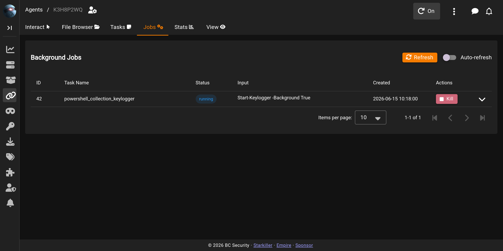

# Agent Jobs

The **Jobs** tab lists the agent's background jobs: long-running taskings, such as keyloggers, that don't complete in one shot but keep returning output over time. A module produces one when it's run with **Background=true**.

## The Jobs table

A **Refresh** button re-polls the agent for its current jobs, and an **Auto-refresh** switch keeps the list updating on its own. Each row shows the job's **ID**, the **Task Name** of the module that started it, a color-coded **Status** chip, a preview of its **Input**, and when it was **Created**. Only active jobs are listed — queued, running, started, or continuous; a job drops off the table entirely once it completes.

The **Actions** column carries a **Kill** button for jobs in a killable state (running, started, or continuous); it opens a confirmation dialog before sending the stop command, and once confirmed reports "Kill command sent for job #`<id>`. The job will be stopped on the agent's next check-in." A job that's active but not yet killable — i.e. still **queued** — shows **N/A** in this column instead.

Expanding a row reveals the job's full input and output, each with its own download button, plus a **Dark Background** switch for the output pane. ANSI colour in the output renders automatically.

When there are no background jobs, the table reads: "No background jobs found. Jobs will appear here when you run modules with Background=true."

