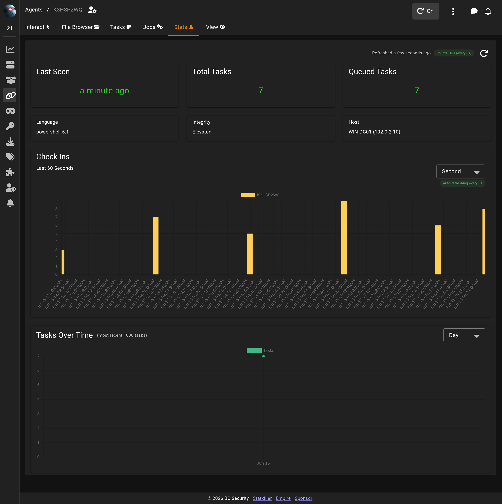

# Agent Stats

The **Stats** tab charts the agent's activity over time: when it has checked in and how its task volume has trended.

## The Stats toolbar

A "Refreshed `<relative time>`" indicator shows how current the data is, next to a status chip labelled **Counts · live** while auto-refresh is running periodically in the background, or a reason it isn't (**Counts · Manual mode**, **Counts · Tab inactive**, **Counts · Archived**, **Counts · No session**, or **Counts · Stopped** when auto-refresh isn't currently running, e.g. before it has started or after the agent stops existing on the server). A manual refresh button next to the chip re-fetches everything on demand. Auto-refresh for this tab is tied to the workspace toolbar's **Auto-refresh Tasks** toggle (see [Agents](agents.md)).

## Topline tiles

Three tiles summarize the agent at a glance: **Last Seen** (relative time since its last check-in), **Total Tasks**, and **Queued Tasks**. If the queued count can't be fetched, its tile shows a warning icon rather than failing the whole page. Below them, three info tiles show **Language**, **Integrity** (Elevated or Standard), and **Host**.

## Check Ins

The **Check Ins** chart plots the agent's check-in history over a selectable timeframe (Day, Hour, Minute, or Second). Each timeframe has its own lookback window and its own auto-refresh cadence — shorter timeframes look back over a shorter window and refresh more often; the Day view covers all time and only updates when you refresh manually. With no check-ins in the current window, the chart area reads "No checkins recorded in this window."

## Tasks Over Time

The **Tasks Over Time** chart buckets the agent's most recent 1,000 tasks by a selectable timeframe (Day, Hour, Minute, or Second). If the agent has more tasks than that, a chip reads "Showing 1000 of `<total>`". With no tasks recorded yet, the chart area reads "No tasks recorded for this agent."

