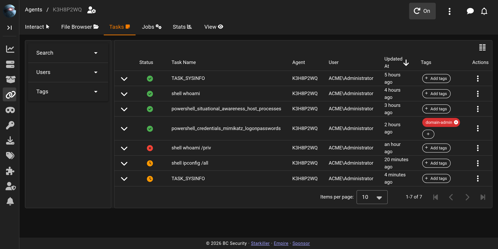

# Agent Tasks

Agent tasks in Empire are managed through a series of status updates that reflect the lifecycle of a task from creation to completion. These statuses help users understand the current state of tasks assigned to agents.

## The Tasks page

The **Tasks** tab lists every tasking issued to the agent, newest first, in a searchable, filterable table.

A **Search** box filters the list by content. Three filters narrow it further: **Agents** (shown only on the global tasks view, i.e. when the table isn't already scoped to a single agent's workspace), **Users**, and **Tags**. On the per-agent Tasks tab, refreshing is controlled by the workspace toolbar's **Auto-refresh Tasks** toggle (see [Agents](agents.md)) rather than a control on the table itself.

The default columns are **Status**, **Task Name**, **Agent**, **User**, **Updated At**, and **Tags**, plus an **Actions** menu for each row. Status renders as an icon matching the statuses described below. The raw Task Input column is hidden by default but can be turned on from the column picker above the table; Task ID is not offered as a column on this page at all. The Actions menu offers Rerun Task and Stop Task, copy/download for the task's input and output, and links to any files the task produced.

Clicking a row's expand arrow reveals the task's output and an input preview inline. Task Input starts truncated, with a **See Full Input** control to load and show the rest; Task Output renders ANSI colour, and for tasks that produced image downloads, a **View Images** control loads inline previews. A Dark Mode Output switch controls the background used for both panes.

## Task statuses

Below are the possible statuses for agent taskings along with descriptions and representative icons.

### Queued

* **Description**: The task is queued for the agent. This status indicates that the task has been created and is waiting to be pulled by the agent.

<figure><figcaption></figcaption></figure>

### Pulled

* **Description**: The agent has successfully pulled the tasking. This status signifies that the agent has received the task and is either processing it or about to start processing.

<figure><figcaption></figcaption></figure>

### Completed

* **Description**: The task has returned data successfully. This indicates that the agent has finished executing the task and has returned the output.

<figure><figcaption></figcaption></figure>

### Error

* **Description**: If an agent reports an error for a task, it will return an ERROR status. This status allows users to identify tasks that did not execute as expected.

<figure><figcaption></figcaption></figure>

### Continuous

* **Description**: A special class for modules like keylogging, since they are handled differently on the server due to their continuous nature. These tasks do not have a definite end and run continuously until stopped.

<figure><figcaption></figcaption></figure>
