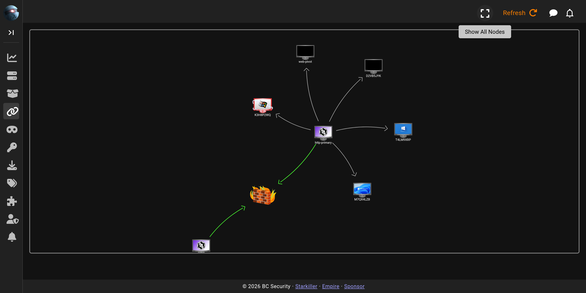

# Agents Graph

The **Agents Graph** screen shows your agents as a node graph rather than a table, making pivot relationships easy to read. Agents that reach the server through another agent (for example over an SMB or port-forward pivot) appear as children of that agent, so the graph shows how each callback is routed.

For the table view and per-agent actions, see [Agents](agents.md).
