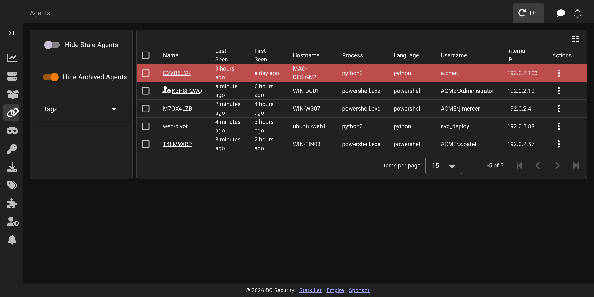
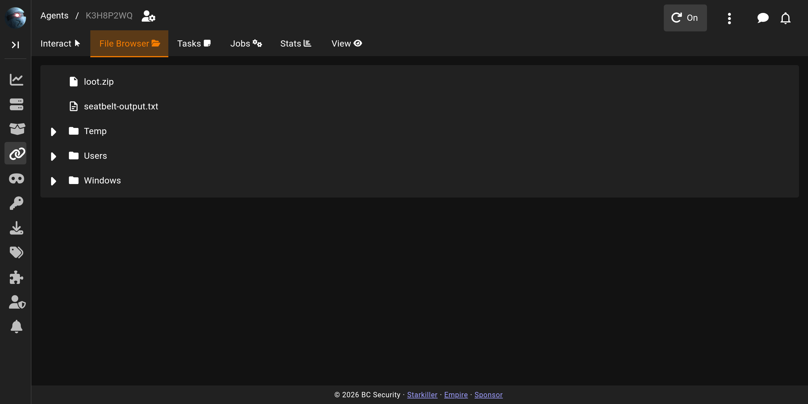

# Agents

The **Agents** screen lists every session that has checked in. It is where you drill into a single agent to task it, browse its filesystem, and review its history.

## The agents list

Each row is one agent. The default columns show its name, when it was first and last seen, the hostname, the process it is running in, the language, the user context, and the internal IP.

An agent that turns **red** is *stale*: it has missed enough check-ins that the server can no longer reach it. A healthy agent keeps the default colour and updates its last-seen time on each check-in.

## The agent workspace

Clicking a row opens the agent's detail view, a tabbed workspace with six tabs:

* **Interact** is the default tab. Task the agent by running a module, dropping to an interactive shell, or opening a full terminal. See [Agent Interact](agent-interact.md).
* **File Browser** walks the agent's filesystem as a tree. Folders expand on click. The listing shown is the last one the agent returned; expanding a folder Empire has not enumerated yet queues a fresh directory task.

* **Tasks** lists every tasking issued to this agent and its status. See [Agent Tasks](agent-tasks.md) for what each status means.
* **Jobs** shows long-running tasks, such as keyloggers, that keep returning output. See [Agent Jobs](agent-jobs.md).
* **Stats** charts the agent's check-in history over time. See [Agent Stats](agent-stats.md).
* **View** holds the agent's editable name, its tasked delay/jitter/kill-date/working-hours, and the host details Empire has collected. See "The View tab" below.

## The per-agent toolbar

The app bar above the tabs carries controls that act on the agent currently open, plus two status indicators. An elevated-process icon appears next to the breadcrumb when the agent is running in a high-integrity process, and an **Archived** chip replaces the toolbar controls once the agent has been archived.

**Upload** opens a dialog to push a file to a path on the agent's filesystem, queuing an upload task. **Download** opens a dialog to pull a file from the agent's filesystem, queuing a download task. **Clear Queued Tasks** cancels every task still sitting in the queue for this agent, after a confirmation prompt. The **Auto-refresh Tasks** toggle controls whether the Tasks and Stats tabs keep polling for updates automatically; it's on by default. **Popout** reopens the agent in its own browser window, without the sidebar, for keeping several agents visible at once. **Subscribe to Notifications** (or **Unsubscribe**, once already subscribed) toggles whether this agent's activity raises notifications for you. **Reload SysInfo** queues a task that refreshes the host details shown on the View tab. **Get Agent Task Status List** queues a task asking the agent to report the status of its outstanding jobs. **Kill Agent**, available while the agent is active, tasks it to exit and returns you to the agents list after you confirm.

## The View tab

Several fields on this tab are click-to-edit, but editing them has two different effects. **Name** writes straight to the agent record; renaming takes effect immediately. **Delay**, **Jitter**, **Kill Date**, and **Working Hours** are also click-to-edit, but changing one queues a task instead: the new value is sent to the agent and takes effect on its next check-in rather than immediately. **Delay** is the number of seconds the agent waits between check-ins. **Jitter** is a decimal between 0 and 1 that randomises the delay. **Kill Date** (`YYYY-MM-DD`) is the date the agent tasks itself to exit. **Working Hours** (`00:00-24:00`) restricts when the agent is allowed to check in.

**Session ID** identifies the agent and is read-only, as is **Lost Limit**, the number of missed check-ins after which the agent exits on its own.

The rest of the tab is read-only host detail collected from the agent: **Host Name**, **Internal IP**, **External IP**, **OS Details**, **Architecture**, **Process Name** and **Process ID**, **Username**, **Language** and **Language Version**, **Listener**, and **Profile**. **Check In Time** and **Last Seen Time** show when the agent first and most recently checked in, as relative times.
