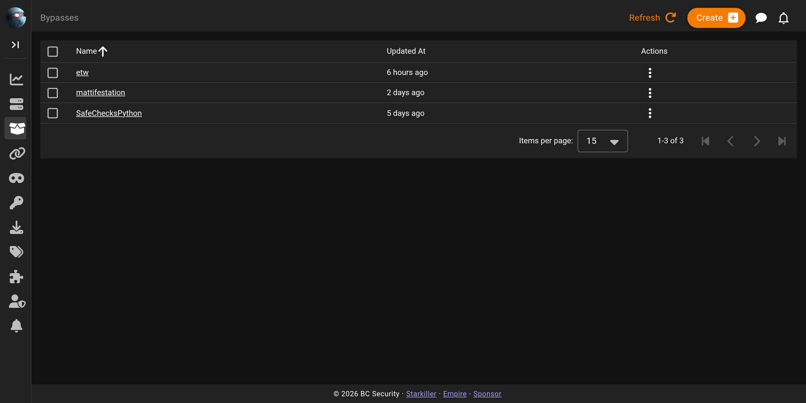
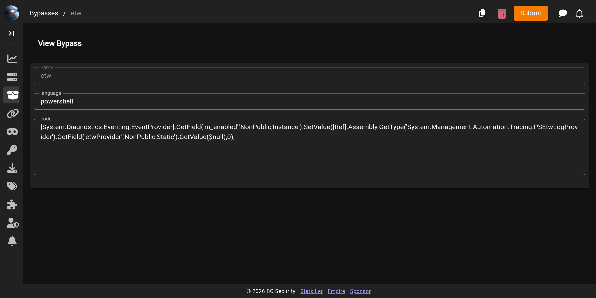

# Bypasses

The **Bypasses** screen lists and edits the bypass records Empire injects into launchers, for example to disable AMSI or ETW logging.

## The bypasses list

Each row is one bypass, with when it was last changed. The row menu lets you view, copy, or delete a bypass, and you can select several to delete at once.

## Viewing and editing a bypass

Clicking a bypass opens its editor. On an existing record the screen labels itself **View**, with the name fixed; the language and code remain editable, and you save changes from here. **Copy** starts a new bypass pre-filled from an existing one.

For what a bypass is, the bypasses Empire ships with, and how to set defaults in `config.yaml`, see [Bypasses](../settings/bypasses.md).
