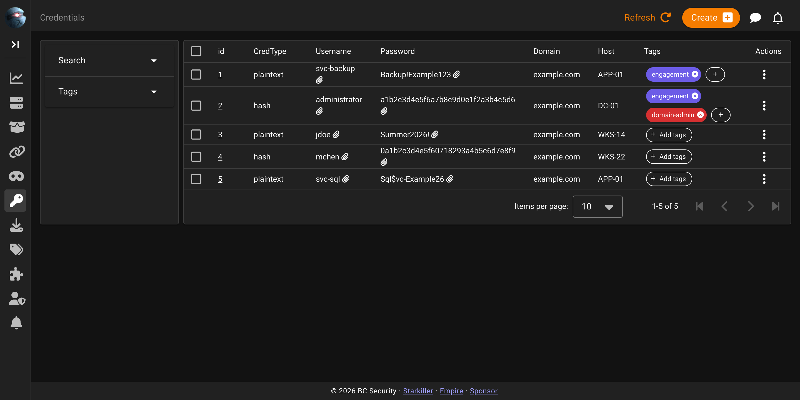
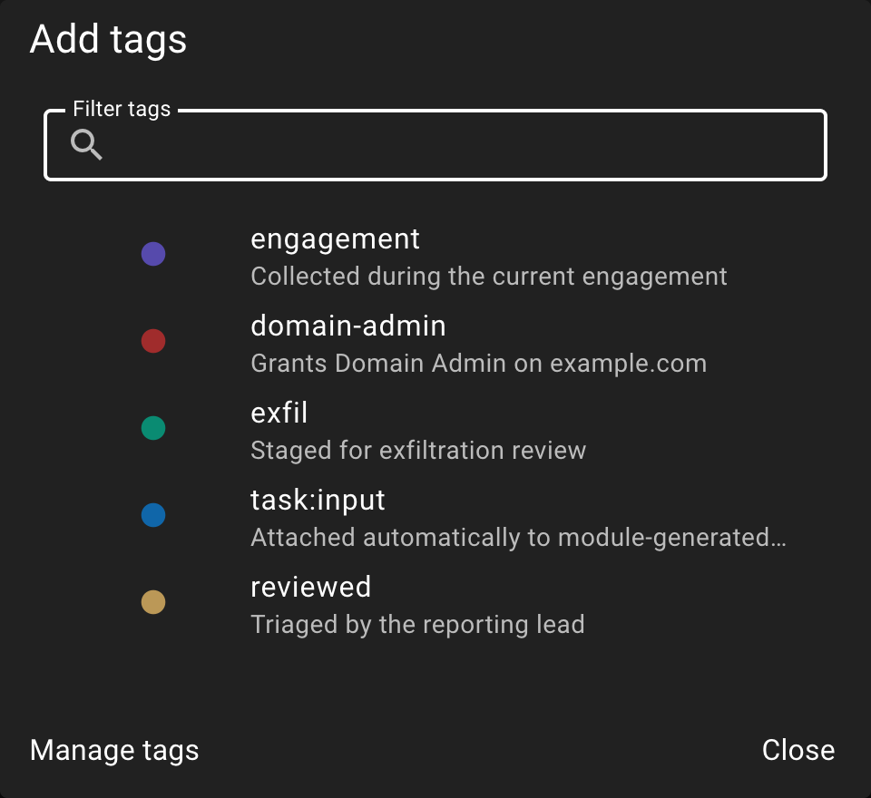

# Credentials

Empire keeps a credential store for everything harvested or entered during an engagement. Rows are added either by hand, through the API, or automatically as modules like `mimikatz` and `Rubeus` parse their own output, and the whole store is reachable from the **Credentials** item in the Starkiller sidebar.

## The credential list

The table shows `Id`, `CredType`, `Username`, `Password`, `Domain`, `Host`, `Tags`, and `Actions`. Both `Username` and `Password` are click-to-copy: click either value and it's placed on the clipboard, indicated by a paperclip icon next to the text. Passwords are displayed in the clear, with no masking, redaction, or reveal-on-click step, so anyone with the page open can read them directly off the table. The left sidebar carries a **Search** box and a **Tags** filter; both start collapsed and only show their contents once clicked.

The `search` parameter matches against `domain`, `username`, `host`, and `password`. That last column is worth remembering: searching for a known password string finds every account reusing it, not just the ones where it happens to live in a more obvious column.

Create, Refresh, and Delete render in the top app bar rather than on the page card, because Starkiller teleports them there for every list screen. Delete only appears once at least one row is selected.

## Credential types

`credtype` is a plain string column with no database enum behind it, so the API will accept any value you send. The table below lists the vocabulary the shipped parsers actually use, and what the `password` column holds for each:

| credtype | What `password` holds |
|---|---|
| `plaintext` | Recovered plaintext password |
| `hash` | 32-char NTLM hex, or `<lm>:<nt>` when a non-empty LM half is present |
| `netntlmv1` | NetNTLMv1 response, format `user::domain:lmresp:ntresp:challenge` (hashcat mode 5500) |
| `netntlmv2` | NetNTLMv2 response, format `user::domain:srvchallenge:ntresp:blob` (hashcat mode 5600) |
| `dcc2` | Domain Cached Credentials v2, format `$DCC2$10240#user#hash` (hashcat mode 2100) |
| `krbtgs` | Full Hashcat/John `$krb5tgs$...` blob, single line |
| `krbasrep` | Full Hashcat/John `$krb5asrep$...` blob, single line |
| `krb_ticket` | Base64 `.kirbi` (pass-the-ticket), or a JSON envelope packing an AP-REQ plus session key (TGT delegation) |
| `dpapi_masterkey` | Masterkey GUID joined to its SHA1-derived key, format `<guid>:<sha1_hex>` |
| `dpapi_system_key` | The `DPAPI_SYSTEM` LSA secret, machine or user hex key |
| `dpapi_vault_cred` | `json.dumps({"url":..., "username":..., "password":...})` |

## Automatic collection

Empire ships twelve registered credential parsers: `mimikatz`, `prompt`, `kerberoast`, `rubeus`, `pwdump_hashes`, `sharp_dpapi`, `session_gopher`, `internal_monologue`, `sharpsecdump`, `ntlmextract`, `tgtdelegation`, and `inveigh`. A module opts into one by declaring `credential_parser` in its YAML, and that value is validated against the registry when the module loads, so a typo there fails loudly at startup rather than silently dropping credentials later. Seventeen shipped modules do this today, including `mimikatz/logonpasswords`, `Rubeus`, and `SharpDPAPI`.

Output from an ad-hoc shell command with no associated module is still checked. Empire falls back to sniffing the first line of output only: a first line starting with `Hostname:` is treated as `mimikatz` output, and a first line starting with `[+] Prompted credentials:` or containing `text returned:` is treated as a credential prompt. A match on a later line doesn't count. Either way, every credential's `notes` field is stamped with the tool name plus a timestamp, so a harvested row typically reads something like `mimikatz 2026-08-02 14:03:11`.

Harvesting failures are deliberately non-fatal, but not uniformly quiet. A parser that throws an exception or returns something other than a list is logged and the row is skipped. A duplicate, meaning a row that collides with an existing credential, is skipped silently, with no log line at all; from the operator's perspective a module that only turned up credentials Empire already has looks identical to one that found nothing. A database error while persisting a row is the one case that isn't scoped to that single row: it aborts the rest of that batch rather than skipping just the offending entry, so later credentials in the same output can be lost along with it.

## Duplicates

Empire rejects a credential that matches an existing one on all four of `credtype`, `domain`, `username`, and `password`, returning HTTP 400 with the message "Credential not created. Duplicate detected." This is an application-level check performed before the insert, not a database constraint, so it applies uniformly whether the credential arrives from the API, the UI, or automatic parsing.

## Tagging credentials

Credentials are one of six taggable resource types in Empire, alongside listeners, agents, agent tasks, plugin tasks, and downloads. To attach a tag, click the "Add tags" chip in a credential's Tags column, which opens the tag picker:

See [Tags](tags.md) for how the registry works.
