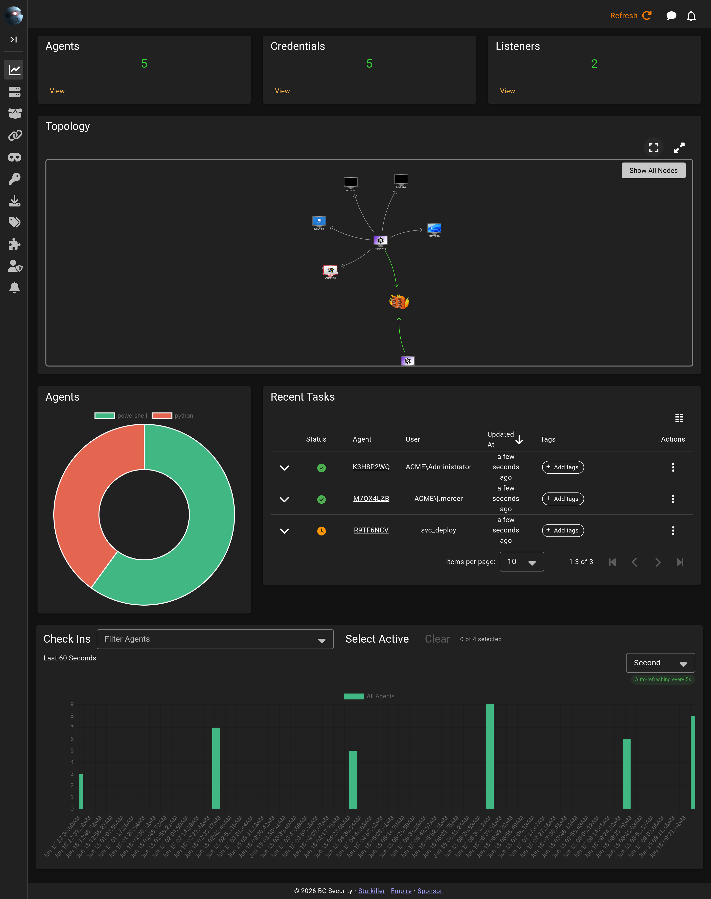

# Dashboard

The **Dashboard** is the screen Starkiller opens on. It summarises the state of the engagement at a glance.

Across the top, three cards count your **Agents**, **Credentials**, and **Listeners**, each linking through to its full screen. Below them, the **Topology** card draws the relationships between your listeners and the agents calling back to them.

Two charts break the numbers down further. The **Agents** doughnut splits your sessions by language, and the **check-in chart** plots callbacks over time. Use the timeframe selector above it to widen or narrow the window. The **Recent Tasks** panel lists the latest taskings across all agents.
