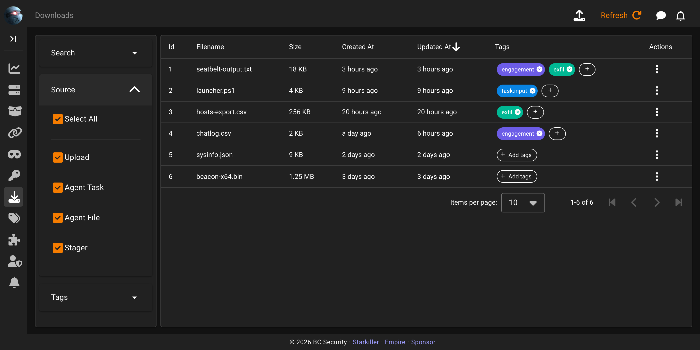

# Downloads

Downloads is Empire's registry of files that moved in either direction during an engagement, either pulled off an agent or uploaded to the server for later delivery. It's reachable from the **Downloads** item in the Starkiller sidebar.

## The downloads list

The table shows `Id`, `Filename`, `Size`, `Created At`, `Updated At`, `Tags`, and `Actions`. The Upload button lives in the top app bar, not on the page card, because Starkiller teleports it there along with Refresh, the same pattern used across list screens. Each row's Actions menu offers a single item, Download, which fetches the file. The list is server-paginated and sortable on `Filename`, `Size`, `Created At`, and `Updated At`.

## Sources

There is no source column on the record itself. The four-way filter in the sidebar is derived by checking which association table a given download's row appears in, which is also why a single file can legitimately show up under more than one source. A file pulled off an agent, for instance, is linked to both the tasking that requested it and the agent's file listing, so it matches both "Agent Task" and "Agent File" at once.

| Source | What produces it |
|---|---|
| `upload` | An operator uploads a file directly from the Downloads screen |
| `agent_task` | A file linked to a specific agent tasking, either generated as the tasking's own input (e.g. a compiled BOF or C# loader script) or received as its output (e.g. the bytes of a pulled file) |
| `agent_file` | A file that also appears in that agent's file browser, set when the pulled file corresponds to an entry in its directory listing |
| `stager` | A stager artifact generated by Empire |

A fifth association, `plugin_task`, exists in the data model: `plugin_task_download_assc` links a `Download` to a `PluginTask`. But the server's own `DownloadSourceFilter` enum only defines `upload`, `stager`, `agent_file`, and `agent_task`. The API rejects `sources=plugin_task` outright, so this isn't a Starkiller GUI decision to expose or not. The filter option doesn't exist to expose.

## Where files are stored

Files live under `<data-dir>/downloads`, where the root is configured by `directories.downloads` in `config.yaml` and, if given as a relative path, is resolved against Empire's platform-specific data directory. An absolute value in the config is used as-is instead of being joined to the data directory.

| Origin | Path under the downloads root |
|---|---|
| Pulled from an agent | `<session_id>/<remote path>/<filename>` |
| Uploaded by an operator | `uploads/<username>/<filename>` |
| Uploaded by the server itself | `uploads_system/<filename>` |

The `uploads/<username>/` path is specifically for the Starkiller Upload button. The text-upload API endpoint, used by plugins to push generated text as a file, writes one directory deeper by default, to `uploads/user/<username>/<filename>`, unless it's called with an explicit subdirectory.

The no-overwrite behavior described below is an upload-only guarantee; it does not apply to files pulled from an agent. Uploads increment the filename: if `report.txt` already exists at the destination, the new upload is saved as `report(1).txt`, then `report(2).txt`, and so on, so an upload never clobbers an existing file. Agent-pulled files behave the opposite way. A file saved to `<session_id>/<remote path>/<filename>` overwrites whatever is already there at that exact path. Pull the same remote file from the same agent twice and the first copy on disk is gone, while the database still gains a second `Download` row pointing at that now-overwritten location. Paths supplied by the agent for a pulled file are validated to stay inside the downloads root before anything is written to disk, closing off directory traversal via a malicious or compromised agent, but that check doesn't protect the first copy from being overwritten by the second.

## Moving files to and from an agent

Pulling a file off an agent is agent tasking, not a Downloads action. It's issued as `POST /api/v2/agents/{id}/tasks/download`, and no Download record exists until the bytes actually arrive back at the server; queuing the task alone does not create one.

Pushing a file to an agent works the other way around: the file has to exist on the server first. Upload it (which creates a Download record), then reference that record's id as `file_id` on `POST /api/v2/agents/{id}/tasks/upload`. Large files are chunked automatically, in 512 KB pieces, so there's no separate size limit to work around manually. This path streams the bytes of the existing Download record straight to the agent; it doesn't create a second record or change the file's tags or source.

There is also a separate, automatic case of tasking-linked files. Some modules, BOF and C# loaders in particular, compile a payload script as part of building their own tasking, and that generated file is saved as a new Download and tagged `task:input`. Filtering by that tag is a quick way to find the exact script a given module tasking sent to an agent.

## Filtering

Search matches against the filename or the stored location, meaning the on-disk path, e.g. `<session_id>/<remote path>/<filename>` for an agent-pulled file, so a search term that only appears in the path still finds the row. The Source panel selects which of the four origins to include and starts with all four selected. The Tags panel filters by tag and starts empty, matching everything. All three panels (Search, Source, and Tags) are collapsed by default; the screenshot above shows the Source panel expanded to illustrate its checkboxes.

See [Tags](tags.md) for how the Tags column and the Tags filter panel work. Downloads are one of the six taggable resource types, and `task:input` above is itself just a tag like any other.
