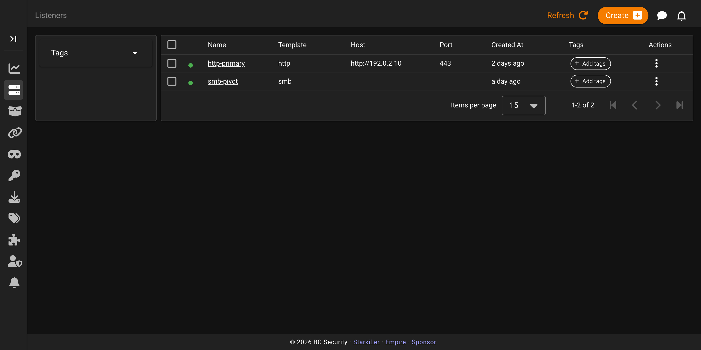
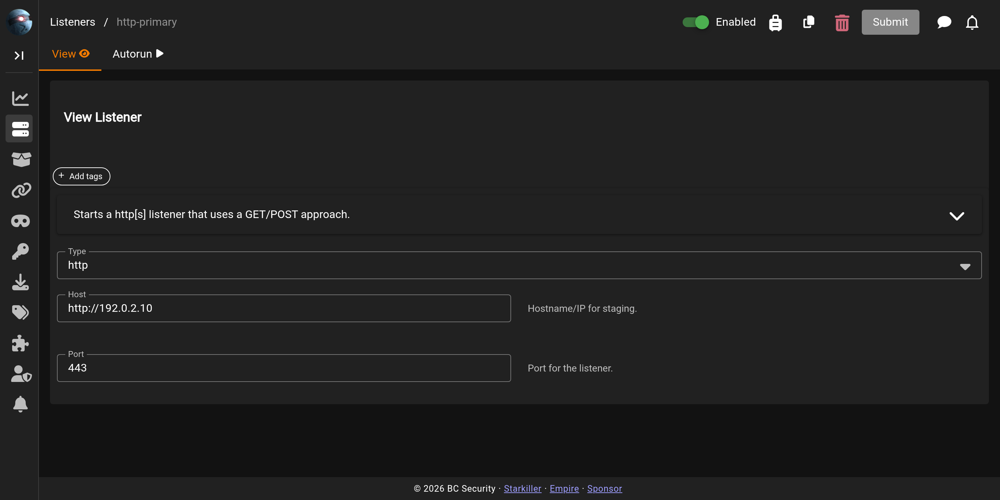

# Listeners

The **Listeners** screen lists the listeners Empire is running and is where you create new ones. A listener is the server-side endpoint agents call back to.

## The listeners list

Each row is one listener, with its name and type. The row menu lets you view, copy, or delete a listener, and you can select several to delete at once.

## Creating and editing a listener

The button above the list starts a new listener; clicking a name opens an existing one. You pick a **Type** first, and the form then shows the options for that listener type. An **Enabled** switch controls whether the listener is running. On an existing listener the screen labels itself with the listener name, and **Copy** starts a new listener pre-filled from this one. The **Autorun** tab sets modules that run automatically against new agents from this listener.

For the individual listener types and their options, see [Listeners](../listeners/README.md).
