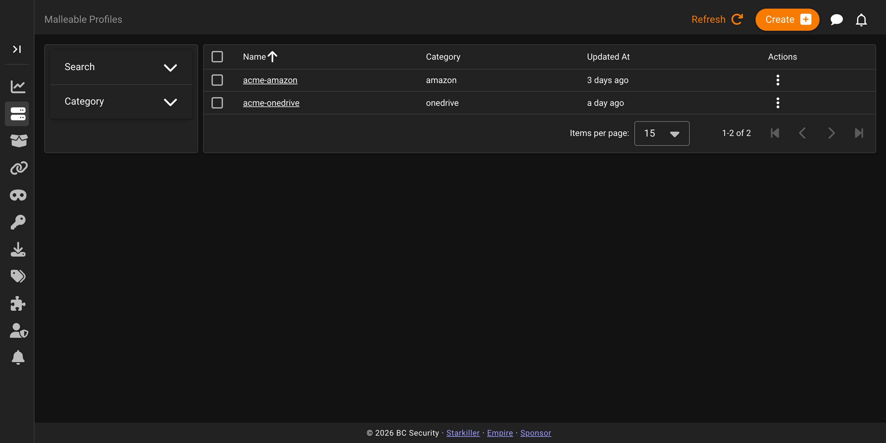
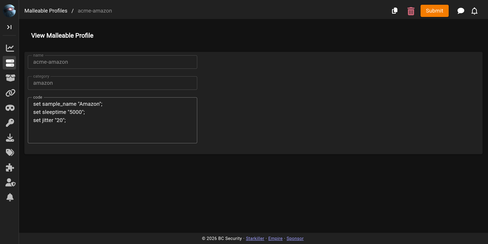

# Malleable Profiles

The **Malleable Profiles** screen lists and edits the Malleable C2 profiles Empire can use to shape HTTP traffic for malleable listeners.

## The profiles list

Each row is one profile, with its name, category, and when it was last updated. The list is searchable and filterable by category, and the row menu lets you view, copy, or delete a profile.

## Viewing and editing a profile

Clicking a profile opens its editor, showing the profile **name**, **category**, and the profile **code**. **Copy** starts a new profile pre-filled from an existing one.

For what a Malleable C2 profile does and how a malleable listener consumes one, see [Malleable C2](../listeners/malleable-c2.md).
