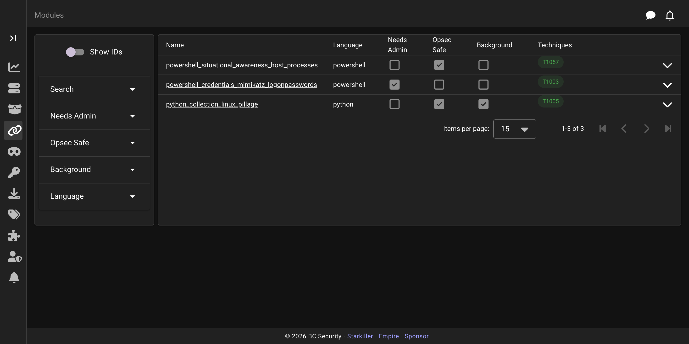

# Modules

The **Modules** screen is where you browse Empire's modules and task agents with them. Modules are the post-exploitation actions you run against a callback.

## Browsing modules

Modules are grouped by language and searchable. The **Show IDs** switch reveals each module's identifier alongside its name.

## Executing a module

Clicking a module opens the execute form. You select one or more agents to task, fill in the module's options, and submit to queue the tasking. Selecting several compatible agents tasks them all at once.

For module options and how modules are configured, see [Module Configuration](../modules/module-configuration.md); for running modules automatically against new agents, see [Autorun Modules](../modules/autorun_modules.md).
