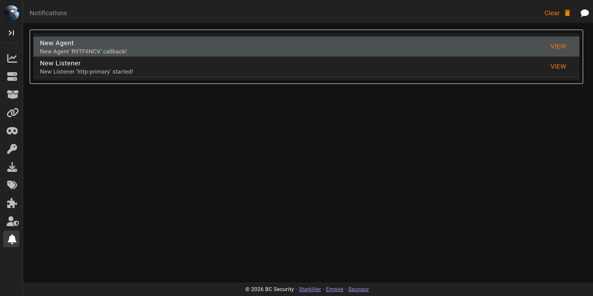

# Notifications

The **Notifications** screen collects the events Starkiller raises as you work: new agents calling back, listeners starting, tasks completing. They arrive over the same live connection that drives the rest of the interface.

Unread items are highlighted; leaving the screen marks them read. Where an event has somewhere to go, its button jumps straight there, for example to the agent that just checked in. **Clear** empties the list.
