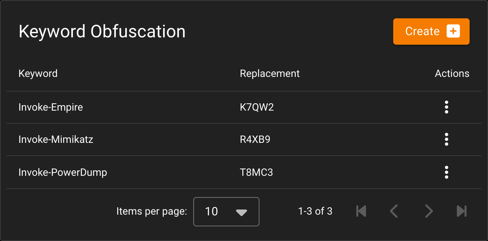
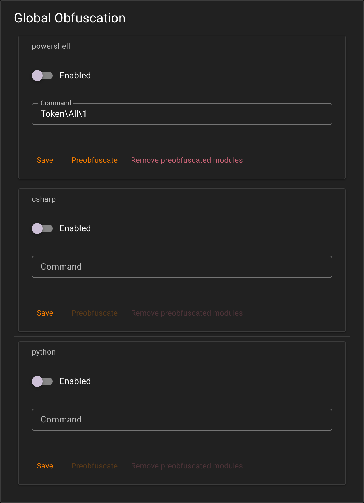

# Obfuscation

Empire has two unrelated obfuscation mechanisms that happen to share one screen in Starkiller: keyword replacement, which is unconditionally applied on the PowerShell module path and rides along with each other build's own obfuscation flag elsewhere, and per-language obfuscation, which is off by default and has to be turned on per language. They don't interact and shouldn't be thought of as one feature, so this page covers them separately.

## Keyword obfuscation

Keyword obfuscation is a global find-and-replace applied to script text before it's sent. Each row is a literal `keyword` and its `replacement`; wherever the server builds a script it substitutes one for the other. As a table, it has no enable/disable switch and no language scoping: the `Keyword` model carries no `enabled` column and no `language` column, unlike the per-language config described below.

Whether a row actually gets applied to a given script depends on which code path builds that script, and that varies. On PowerShell module generation, keyword substitution runs unconditionally at the end of every build, regardless of whether per-language PowerShell obfuscation is enabled, so it's genuinely always-on for that path. On Python module generation and on stager launcher generation (both PowerShell and Python), keyword substitution instead rides along with that build's own obfuscation flag: it only runs when obfuscation is actually being requested for that script, and is skipped entirely when it isn't. So don't assume every keyword row reaches every script Empire generates; the PowerShell module path is the one place that's unconditionally true.

Unlike the rest of Starkiller's list screens, where Create renders in the top app bar, the keyword table's Create button sits on the card itself. It's the same orange `Create +` control used elsewhere, just relocated, and it's the only Create button on this screen (the app bar above the card doesn't render one here).

Both `keyword` and `replacement` must be at least three characters. A fresh install seeds two entries, `Invoke-Empire` and `Invoke-Mimikatz`, each given a random five-character replacement generated at install time, so the replacement values differ from one install to the next and there's no way to predict them ahead of time. (The screenshot above shows a third row, `Invoke-PowerDump`; that one was added by hand to illustrate the table with more than the seed data. A fresh install only ever gives you the first two.)

## Global obfuscation

Global obfuscation is configured per language and gated on an `enabled` flag; it does nothing unless switched on for that language. Keyword replacement only shares that all-or-nothing gating on the Python and stager launcher paths, where it rides along with this same flag; on the PowerShell module path, keyword replacement runs regardless of what's configured here.

The shipped defaults, from `config.yaml`:

| Language | Enabled | Command | Module | Preobfuscatable |
|---|---|---|---|---|
| powershell | no | `Token\All\1` | `invoke-obfuscation` | yes |
| csharp | no | *(none)* | `confuser` | no |
| python | no | *(none)* | `python-obfuscator` | no |

All three languages ship disabled. Only PowerShell is preobfuscatable, which is why the Preobfuscate and Remove preobfuscated modules buttons are visible but greyed out (disabled, not hidden) for csharp and python in the screenshot above; Save is the only button that stays clickable for those two. BOF modules don't get a configuration row of their own; they borrow whatever the csharp configuration says.

The three modules do genuinely different things:

* **PowerShell** shells out to the vendored Invoke-Obfuscation, running it as a subprocess against the script text.
* **Python** runs the `python_obfuscator` package's one-liner and variable-renamer passes in-process.
* **C#** doesn't go through this service at all. `confuse` is passed straight through as a flag to the .NET compiler, which does the obfuscation as part of compiling the module.

These defaults seed into the database on first boot only. The check is "does an obfuscation config row already exist," and once it does, editing `config.yaml` afterward changes nothing. Changing the command, module, or enabled state after that first boot has to happen on this screen or through the API.

## Preobfuscation

Running a PowerShell script through Invoke-Obfuscation is slow enough that doing it on every tasking would be a bad idea. Preobfuscation runs it once ahead of time, caches the result, and lets normal tasking reuse the cached, already-obfuscated file instead of re-running Invoke-Obfuscation each time. It's triggered only by an operator clicking Preobfuscate, never automatically.

"Remove preobfuscated modules" deletes the entire preobfuscation cache, regardless of which language's button was pressed. Since only PowerShell is preobfuscatable today, that distinction happens to be moot in practice, but it's worth knowing that the button isn't scoped to "this language's cached files" if that ever changes.

## When obfuscation silently does nothing

This is the most important thing to know about global obfuscation. Every one of the following returns the unobfuscated script and only writes a line to the server log; no error surfaces to the operator, and no task fails:

* PowerShell is not installed on the server host.
* The obfuscation subprocess exceeds `obfuscation.timeout`, 300 seconds by default.
* The subprocess exits non-zero.
* The subprocess produces empty output.

The operational consequence: an operator who enables PowerShell obfuscation on a host without `pwsh` gets working tasks back (the agent still executes them fine) but none of them are actually obfuscated, and nothing in Starkiller says so. The task looks the same either way. The install script does install PowerShell by default on Debian, Kali, and Parrot, so this mostly bites manual installs and non-Debian-family systems where PowerShell was never set up in the first place.
