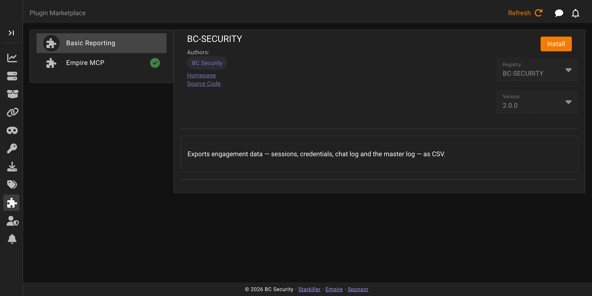

# Plugin Marketplace

The **Plugin Marketplace** screen is where you browse and install plugins from a registry rather than adding them by hand. The list shows each available plugin with its name and description.

Selecting a plugin shows its registry, the installed version if any, and a version to install, along with the button to install it. Once installed, **Go To Plugin** opens the plugin so you can enable and configure it.

For configuring an installed plugin, see [Plugins](plugins.md).
