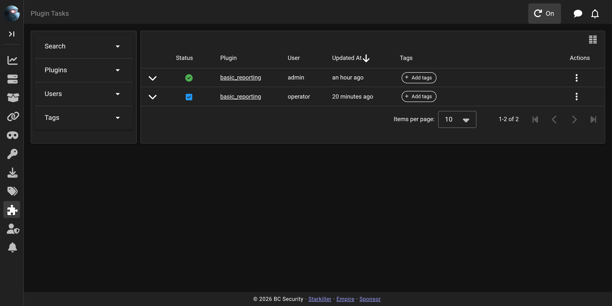

# Plugin Tasks

The **Plugin Tasks** screen is the history of everything the server's plugins have run. Each row is one task, showing the plugin, the operator who ran it, and the task itself. The list is searchable.

To run a plugin, see [Plugins](plugins.md).
