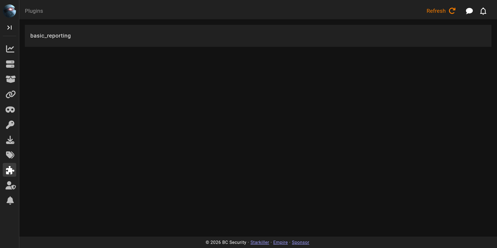
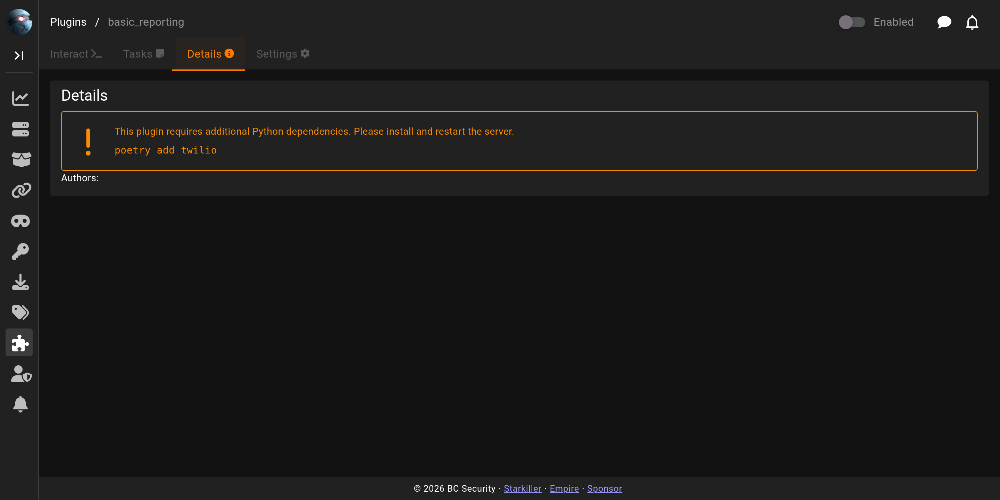

# Plugins

The **Plugins** screen lists the plugins installed on the server and is where you enable, configure, and run them. Plugins extend Empire with extra functionality loaded at startup.

## The plugins list

Each row is one installed plugin. Clicking a plugin opens it.

## Configuring and running a plugin

A plugin opens to tabbed sections. **Details** describes the plugin and shows any dependencies it needs. **Settings** holds the plugin's configurable options, or reports that it has none. An **Enabled** switch loads or unloads the plugin. When the plugin is loaded, the **Interact** tab runs the plugin through a form, and the **Tasks** tab shows what it has run.

For writing your own plugins, see [Plugin Development](../plugins/development/README.md).
