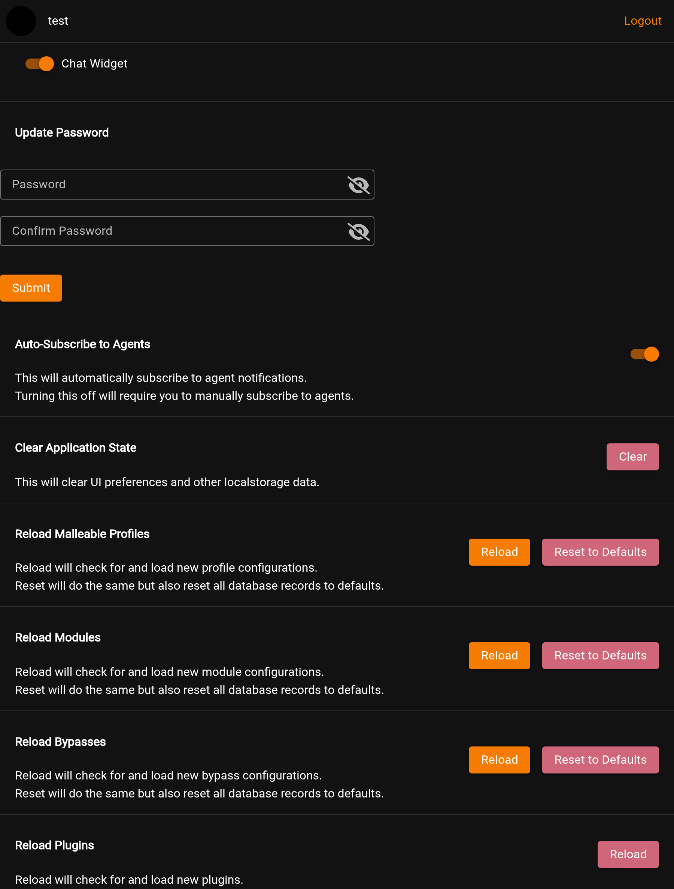

# Settings

This is the Starkiller **Settings** screen: your account and per-user preferences. It is separate from the server-side settings documented under [Settings](../settings/README.md), which configure Empire itself through `config.yaml`.

At the top are your avatar and a **Logout** button. The **Chat Widget** toggle shows or hides the operator chat. **Update Password** changes your own password. **Auto-Subscribe to Agents** controls whether new agents subscribe you to their notifications automatically. **Clear Application State** resets local UI preferences.

The four **Reload** sections at the bottom refresh Empire's on-disk definitions into the database: Malleable profiles, modules, bypasses, and plugins. **Reload** picks up new or changed files. Malleable profiles, modules, and bypasses also offer **Reset to Defaults**, which restores those database records to their shipped state; plugins offer Reload only.
