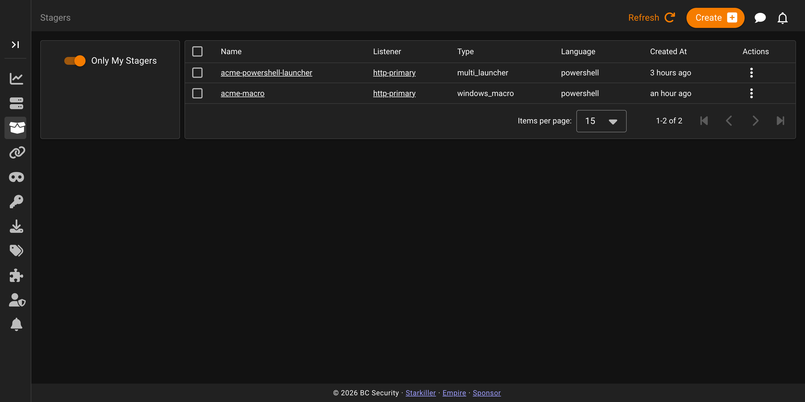

# Stagers

The **Stagers** screen lists generated stagers and is where you build new ones. A stager is the launcher that delivers and starts an agent on a target.

## The stagers list

Each row is one generated stager. The **Only My Stagers** filter narrows the list to stagers you created. The row menu lets you view, copy, or delete a stager.

## Generating and editing a stager

The button above the list starts a new stager; clicking a name opens an existing one. You choose a **Type** and give the stager a **Name**, and the form shows the options for that stager type. Saving generates the stager and shows its output, which you copy or download to run on the target.

For the stager types Empire ships with, see [Stagers](../stagers/README.md).
