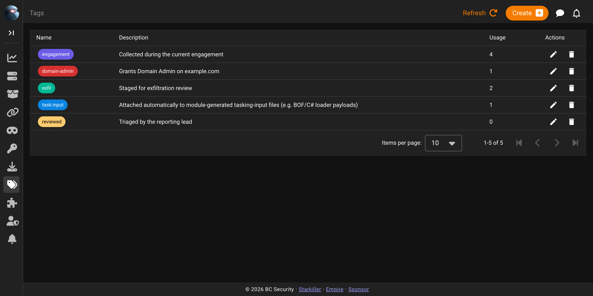

# Tags

Tags are a global registry of labels that can be attached to several kinds of resource. They exist to let an operator group an engagement's artifacts (mark a batch of credentials as `domain-admin`, flag a download as `exfil`, or track everything gathered today as `engagement`) and then filter lists down to just those items. The registry is reachable from the **Tags** item in the Starkiller sidebar.

## The tag registry

The table shows `Name` (rendered as a coloured chip), `Description`, `Usage`, and `Actions`. Create renders in the top app bar, the same pattern used across Starkiller's list screens. Actions itself is two inline icon buttons, a pencil to edit and a trash to delete, rather than the overflow menu other list screens use.



**Usage** counts attachments across every taggable type at once, not just one. A tag used on two credentials and two agents reports `4`, and there's nothing in that single number to say how the count splits. It also doesn't distinguish an automatic attachment from a manual one: Empire attaches the `task:input` tag automatically to certain module-generated downloads (see [Downloads](downloads.md)), and if an operator also attaches `task:input` to a credential or agent by hand, both kinds of attachment land in the same Usage total with no way to tell them apart from this column alone.

## What can be tagged

Exactly six resource types are taggable:

* Listeners
* Agents
* Agent Tasks
* Plugin Tasks
* Credentials
* Downloads

Two of those come with a catch: agents and listeners are taggable, but neither list endpoint accepts a tag filter. `GET /api/v2/agents` takes only `include_archived` and `include_stale`; there is no `tags` query parameter to narrow it. The same is true of the listeners list. Tag filtering in the API only works on credentials, downloads, agent tasks, and plugin tasks. You can still tag an agent or a listener, since the tag picker works the same way everywhere, you just can't ask the agents or listeners endpoint to hand back only the tagged ones.

## Colors

A tag created without an explicit color gets a deterministic one: `#` followed by the first six hex characters of the MD5 hash of the tag's name. The same name always produces the same default color, on every install, which is a convenient way to get consistent colors for common tags like `domain-admin` without coordinating across operators. The default can be overridden at creation or changed afterward.

Accepted color formats are `#rgb`, `#rgba`, `#rrggbb`, and `#rrggbbaa`, meaning three, four, six, or eight hex digits. Five and seven digits are explicitly rejected.

## Filtering by tag

`?tags=` repeats for multiple values and means OR, not AND:

```bash
curl "https://<empire>/api/v2/credentials/?tags=prod&tags=staging" \
     -H "Authorization: Bearer <token>"
```

This returns every credential carrying either `prod` or `staging`, not just ones carrying both.

That's a different axis from `GET /api/v2/tags?sources=credential`, which filters the *registry* itself, showing only tags that are attached to at least one credential anywhere, rather than filtering credentials by tag. The two are easy to conflate: one asks "which credentials have this tag," the other asks "which tags are in use on credentials."

## Attaching and removing

Attaching a tag to a resource takes an existing `tag_id`. The attach endpoint cannot create a tag as a side effect, and passing an unknown id returns 404. Create the tag first, then attach it.

Removing a tag from a single resource only detaches it; the registry entry itself survives and stays available to attach elsewhere. Deleting a tag from the registry (the trash icon on the Tags screen) removes it from every resource it was attached to, all at once.

Creating a tag with a name that already exists returns 409.

## A note on case sensitivity

Tag-name uniqueness is enforced by the database, not by application code, so the two backends disagree: on MySQL, `Prod` and `prod` collide as the same tag; on SQLite, they're two distinct tags. This is worth knowing before moving a database between backends, since a set of tags that looked clean on MySQL can silently double up once restored into SQLite, or vice versa.
