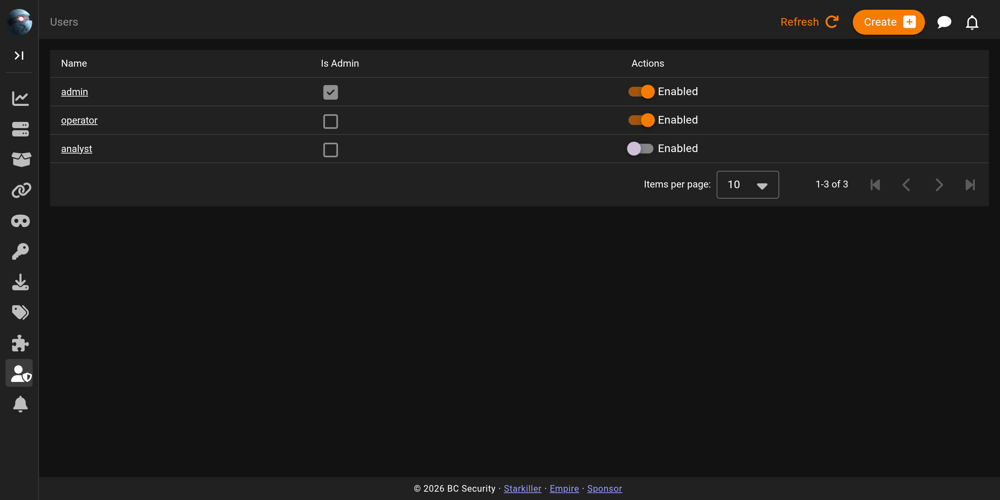
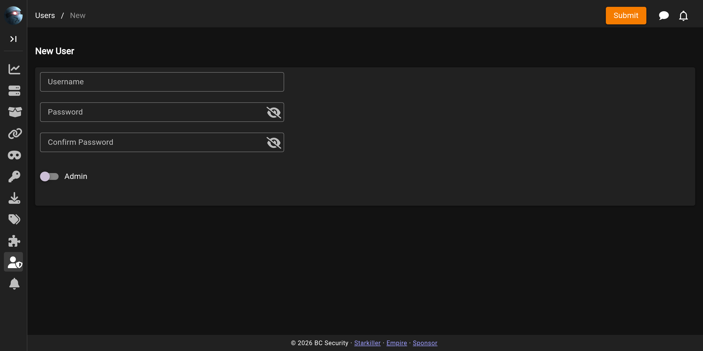

# Users

The **Users** screen is where administrators manage operator accounts. Non-admin operators can view the list; creating, editing, and disabling accounts are admin-only.

## The users list

Each row is one operator: their name, whether they are an administrator, and a switch to enable or disable the account.

## Creating and editing a user

Administrators create a user with the button above the list and edit an existing one by clicking its name.

A new user needs a username, a password, and a confirmation. When editing an existing user the username is fixed; you can toggle whether the account is an administrator and whether it is enabled. Disabling an account keeps its history but blocks it from logging in.
